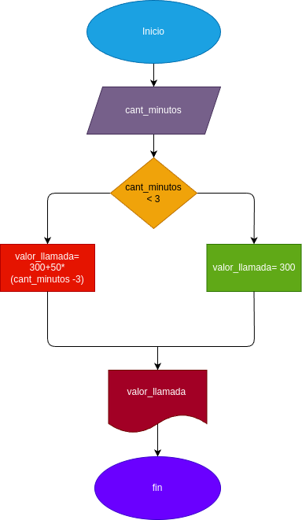

# Condicionales_1
condicionales #1
## Costo de una llamada telefonicas
ingresar el tiempo de  duracion una llamada telefonica y determinar la cantidad a pagar de acuerdo a lo siguiente:
- toda llamada que 3 minutos o menos tiene un costo de 300 pesos.

- cada minuto adicional cuesta 50 pesos.

## Input 

### Variables de entrada 
cant_minutos: cantidad de minutos que duro la llamada
### Prosesing 
valor_llamada: calcular el valor final de la llamada

si es menor o igual a 3 minutos: el valor final sera de 300 pesos

si es mayor a 3 minutos: 300+50* (cant_minutos -3)

### output
valor_llamada
# Diseño

# Construccion